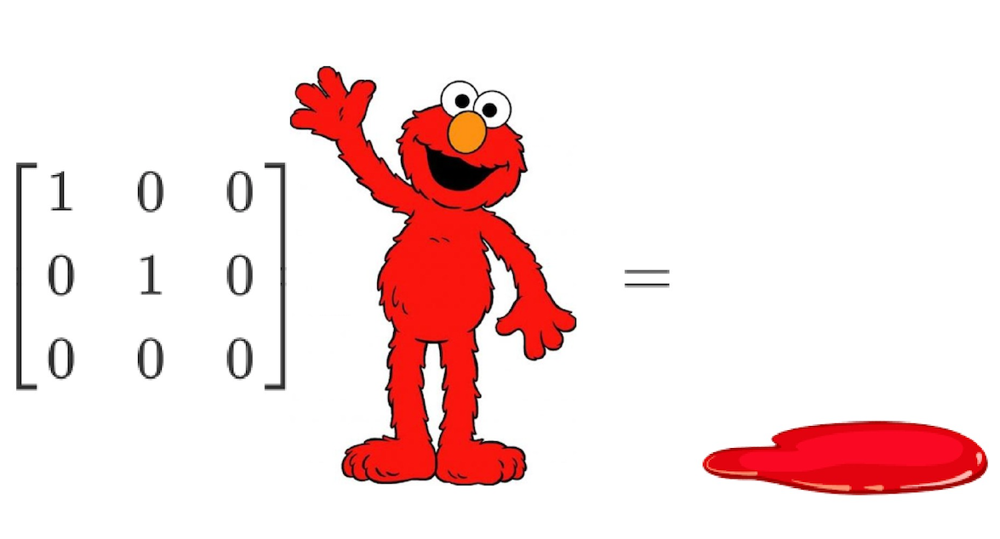

## MATH2121 Tutorial Page


- Sessions: **T2A** and **T2B**
- TA: PANG Wai Ho (Jade)
- Email: whpangaa@connect.ust.hk


<!-- {height="700px" width="700px"} -->

### Tutorial Notes
<!-- - <a href="https://hkustconnect-my.sharepoint.com/:b:/g/personal/whpangaa_connect_ust_hk/EZiM5gyO2oJEs3jrJ7mtvqoBAOMY2Z5pUip7BCXoAqJ2pA?e=LOyZP6" target="_blank">Tutorial 1</a> (<a href="https://hkustconnect-my.sharepoint.com/:b:/g/personal/whpangaa_connect_ust_hk/Ebpd_ZeCd_RJuAuC9qhDZzABZ5WsCuVoMGwmN7ZvPSiPDw?e=xtaOfO">Solution</a>) -->

- [Tutorial 1](https://hkustconnect-my.sharepoint.com/:b:/g/personal/whpangaa_connect_ust_hk/EZiM5gyO2oJEs3jrJ7mtvqoBAOMY2Z5pUip7BCXoAqJ2pA?e=LOyZP6) 
<!--[Tutorial 2](https://hkustconnect-my.sharepoint.com/:b:/g/personal/whpangaa_connect_ust_hk/EW9fywG0xFVJtWwjK4bThAcBu7ztXn1DG5sHw997N3hIjg?e=cKUgDc)-->


### Exercises
 _(These are just the exercises from the notes above.)_
- [Exercise 1](https://hkustconnect-my.sharepoint.com/:b:/g/personal/whpangaa_connect_ust_hk/Ebpd_ZeCd_RJuAuC9qhDZzABZ5WsCuVoMGwmN7ZvPSiPDw?e=xtaOfO)
<!--[Solution](https://hkustconnect-my.sharepoint.com/:b:/g/personal/whpangaa_connect_ust_hk/Ecev-rCMlzdLsw1KErT0g4kB44WBMrVYpt4o6srpxqi5lg?e=1SQ0cG)  -->


<!-- You can use the [editor on GitHub](https://github.com/jade-pang/MATH2121/edit/main/README.md) to maintain and preview the content for your website in Markdown files.

Whenever you commit to this repository, GitHub Pages will run [Jekyll](https://jekyllrb.com/) to rebuild the pages in your site, from the content in your Markdown files. -->

<!-- ### Markdown

Markdown is a lightweight and easy-to-use syntax for styling your writing. It includes conventions for

```markdown
Syntax highlighted code block

# Header 1
## Header 2
### Header 3

- Bulleted
- List

1. Numbered
2. List

**Bold** and _Italic_ and `Code` text

[Link](url) and 
```

For more details see [GitHub Flavored Markdown](https://guides.github.com/features/mastering-markdown/).

### Jekyll Themes

Your Pages site will use the layout and styles from the Jekyll theme you have selected in your [repository settings](https://github.com/jade-pang/MATH2121/settings/pages). The name of this theme is saved in the Jekyll `_config.yml` configuration file.

### Support or Contact

Having trouble with Pages? Check out our [documentation](https://docs.github.com/categories/github-pages-basics/) or [contact support](https://support.github.com/contact) and we’ll help you sort it out.
 -->
